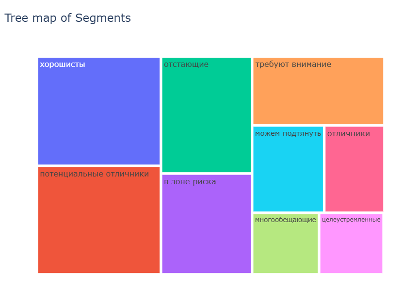

### "Анализ платформы онлайн-образования"  

**Цель:**  
Необходимо проанализировать поведение студентов на курсах, предметах и экзаменах онлайн-школы.

**Описание данных:**  
Выгружены следующие данные:  
- информация об оценках в тестах по предметам;  
- список предметов по семестрам;  
- результаты тестов студентов;  
- информация о времени, когда студент зарегистрировался для прохождения курса.

**Стек:**
Python (pandas, plotly, requests).

**Этапы работы**:   
1. Найдено количестов студентов, успешно сдавших только один курс (успешная сдача — это зачёт по курсу на экзамене);    
2. Выявлены самый сложный и самый простой экзамен: найдены курсы и экзамены в рамках курса, которые обладают самой низкой и самой высокой завершаемостью (завершаемость= кол-во успешных экзаменов / кол-во всех попыток сдать экзамен);    
3. Выявлены самые популярные курсы (ТОП-3) по количеству регистраций на них, а также курсы (ТОП-3) с самым большим оттоком (отток - это отмена регистрации на предмет);  
4. В период с начала 2013 по конец 2014 выявлены семестры с самой низкой завершаемостью курсов и самыми долгими средними сроками сдачи курсов;    
5. Написана функция, позволяющая строить когортный (семестровый) анализ;   
6. Построены адаптированные RFM-кластеры студентов, для качественной оценки аудитории.

Ознакомиться с файлом решения можно здесь: **[E-learning](https://github.com/NailyaGalina/Data_analysis_E-learning_project/blob/main/E-learning.ipynb)**  

**Результат:**  
Построена итоговая карта сегментов студентов (RFM-сегментация):

 
 

*Проект разработан мной на основе материалов, автор которых - [karpov.courses](https://karpov.courses)

